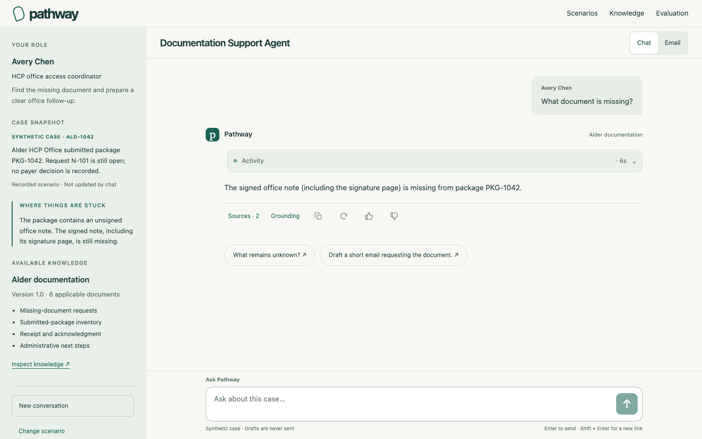
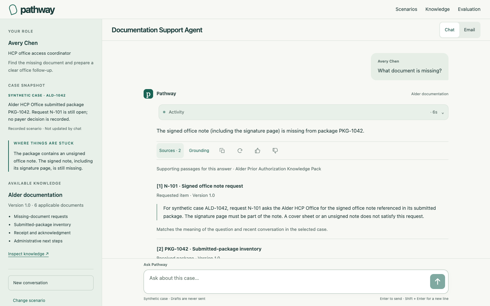
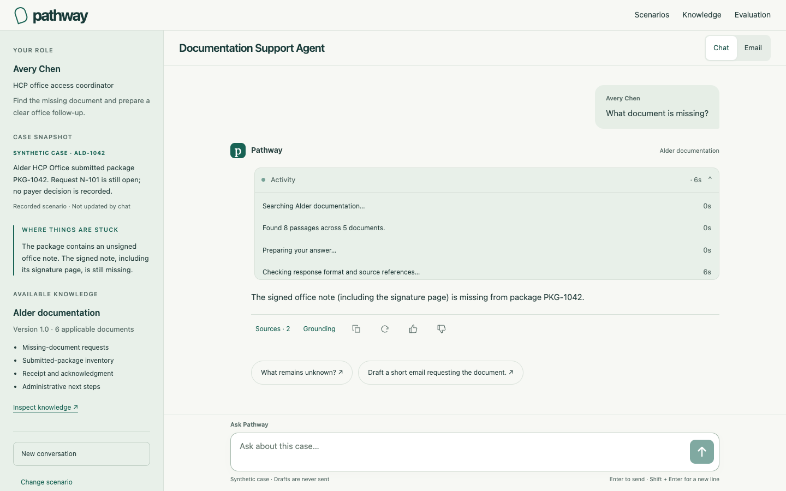
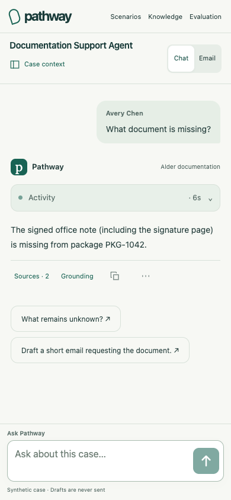
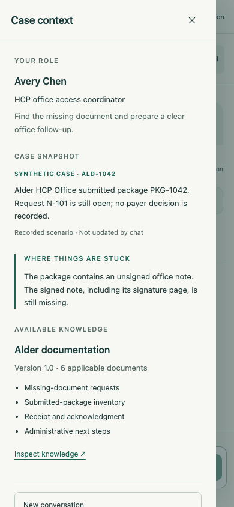
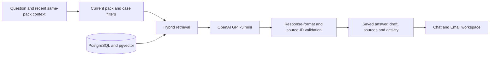

# Pathway

**Support that knows its sources.**

Pathway is an AI support agent for non-clinical pharmaceutical access and patient-support work. Choose a synthetic case, ask a question, prepare an email or case briefing, and inspect the knowledge behind the answer.

**[Try the live demo](https://case-resolution-frontend.onrender.com/)** · [Explore the knowledge](https://case-resolution-frontend.onrender.com/#knowledge) · [View evaluation](https://case-resolution-frontend.onrender.com/#evaluation)



## The workspace

Case context stays on the left; conversation and drafts have their own space on the right. On mobile, **Case context** opens a keyboard-accessible drawer. The composer stays visible beneath the conversation.

- **Understand the case.** See your role, the recorded case snapshot, where things are stuck, and the selected Knowledge Pack’s version, topics and applicable document count.
- **Ask naturally.** Follow up with questions such as “Why?” or “What remains unknown?” Pathway uses recent conversation within the same knowledge boundary to resolve references.
- **Work in Chat or Email.** Create office follow-ups, case briefings and patient-friendly administrative messages. Copy a draft or ask Pathway to refine it. Drafts are generated for review and never sent.
- **Inspect the evidence.** **Sources** shows exact cited passages with document titles, sections and versions. **Grounding** explains the contextual query, retrieval ranks and passages used to prepare the answer.
- **See work in progress.** Live activity shows knowledge search, retrieved document counts, answer preparation and source-reference checks. Elapsed time is visible while waiting; completed activity remains available above the answer.
- **Keep control.** Copy, regenerate, give feedback or retry a failed request. Conversations, source snapshots and completed activity survive reload within the browser session.

The sidebar describes the scenario’s recorded snapshot. Conversation text does not change case status. Switching knowledge updates the current context while earlier answers retain their original case and sources.

<details>
<summary><strong>See sources, activity and mobile views</strong></summary>

### Exact supporting passages



### Visible activity



### Mobile conversation and case context

 

Screenshots show the public demo with a saved synthetic answer.

</details>

## Three scenarios

| Scenario | Your role | Recorded blocker | Useful output |
| --- | --- | --- | --- |
| **Documentation support** · ALD-1042 | Avery Chen, HCP office access coordinator | The submitted package has an unsigned office note; the signed note and signature page are missing. | An office email requesting the signed note. |
| **Coverage & access** · ACC-2086 | Morgan Lee, field reimbursement manager | An unreadable Juniper Plan member identifier blocks benefit verification. | An HCP-office briefing or follow-up email. |
| **Specialty pharmacy fulfillment** · FUL-3091 | Jordan Rivera, patient-support case manager | The consent signature is missing; intake is recorded, but no dispense release or carrier handoff is recorded. | A patient-friendly administrative status message. |

All people, organizations, plans, cases and documents are fictional. Each Knowledge Pack contains eight documents: six applicable sources, one superseded source and one record for another case. The complete corpus contains **24 documents and 38 passages**. Excluded documents are inspectable in the knowledge browser but cannot support a new answer.

## Try a conversation

1. Open the demo and choose **HCP office documentation support**.
2. Ask **“What document is missing?”**, then **“Why is it being requested?”**
3. Ask **“Draft a short email requesting the document.”** Follow with **“Make it warmer and shorter.”**
4. Open **Sources** to read the supporting passages, or **Grounding** to inspect retrieval.
5. Switch Knowledge Packs to explore another case and its evidence boundary.

## How it works



| Layer | Implementation |
| --- | --- |
| Interface | Semantic HTML, CSS and browser JavaScript; responsive context drawer and independent conversation scrolling. |
| Server | Node.js 24 and TypeScript, with session-scoped HTTP APIs. |
| Generation | OpenAI **GPT-5 mini** through the Responses API, with low reasoning effort and structured outputs. |
| Retrieval | PostgreSQL/pgvector hybrid vector and lexical ranking; OpenAI `text-embedding-3-small` embeddings cached persistently. |
| Evidence | Current-source, pack and case filtering; validated citation membership and saved exact source snapshots. |
| Progress | Persisted application events streamed as NDJSON, with bounded status polling when the hosting proxy buffers updates. No additional model calls. |
| Hosting | Render static frontend and Node backend, with a dedicated Supabase PostgreSQL database. |

Generation uses retrieved evidence and explicit scenario context. Conversation history helps resolve references; it does not establish new facts. A malformed response can receive one bounded format repair using the same evidence. API keys stay on the server, and provider request budgets are enforced persistently.

## Run locally

Requires **Node.js 24.12+**, **PostgreSQL 18.6** and **pgvector 0.8.6**. The local launcher supports the documented macOS/Homebrew installation; see the [database setup guide](docs/persistence-runbook.md) for pinned binaries and connection configuration.

```sh
npm ci
npm run db:start
npm run db:migrate
npm run rag:seed
npm run build
cp .env.example .env
```

In your ignored `.env` file, set `OPENAI_API_KEY` to your own key and `PATHWAY_LIVE_GENERATION=enabled` to enable answers. Keep `PATHWAY_RAG_MODEL=gpt-5-mini`, `PATHWAY_RAG_REASONING=low`, and positive provider request limits. Live answers and uncached embeddings use your OpenAI account’s API budget.

```sh
node --env-file=.env dist/src/app/server.js
```

Open [localhost:3000](http://127.0.0.1:3000). Without live generation configured, the catalog and interface remain available, but Pathway cannot produce a live answer. The first enabled request indexes any missing corpus embeddings.

## Verification

```sh
npm run typecheck
npm test
npm run test:rag
npm run build
node scripts/verify-hygiene.ts
```

The RAG suite requires the migrated local database. Automated checks use synthetic provider responses and make no paid model calls. The documented activity release passed **118 automated tests and 138 browser checks**, including desktop/mobile layouts, citations, copy, refinement, retries, knowledge switching, progress and reload.

The retained 36-turn synthetic conversation evaluation completed all turns, with **98.61% expected-passage recall** and **115/115 cited IDs present in retrieval**. Its semantic review found **34/36 complete criterion matches**; the two partial results and targeted follow-up checks are documented. Citation membership alone does not prove every phrase is supported, and these results are not independent clinical validation.

- [Conversation evaluation and limitations](docs/rebuild/conversation-review-2026-09-12.md)
- [Workspace behavior and browser checks](docs/rebuild/compact-workspace.md)
- [Activity, persistence and public verification](docs/rebuild/live-activity.md)
- [Canonical scenario and knowledge definitions](src/rag/corpus.ts)
- [Response and conversation contracts](src/rag/contracts.ts)

## Demonstration boundaries

Use the supplied synthetic cases. Pathway does not provide clinical advice, make payer or eligibility decisions, promise dispensing or delivery, or perform real outreach. Review generated drafts before using their wording. Sessions expire after four hours; this portfolio demonstration is not a production healthcare system.
