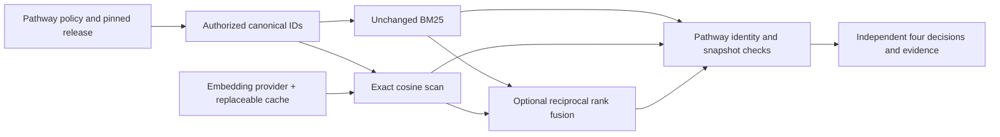
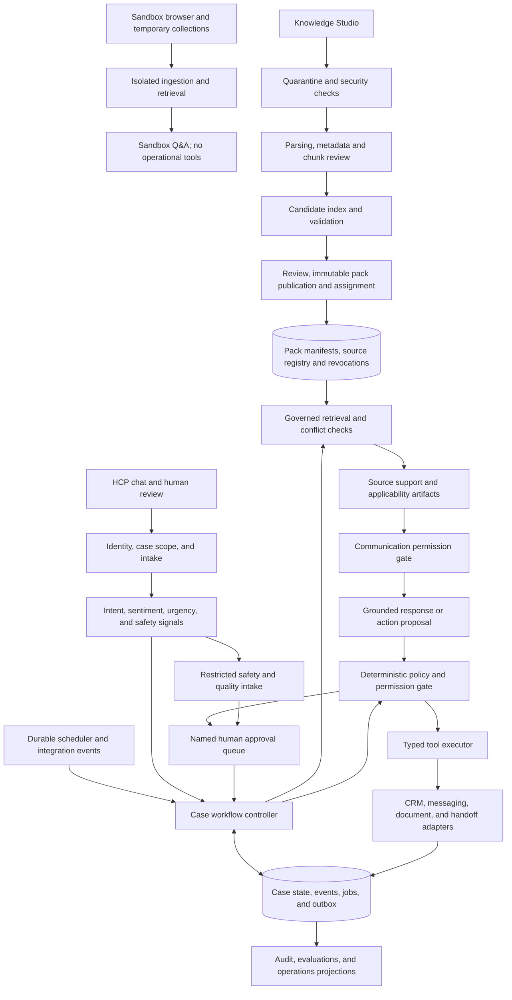

# System architecture

September 8 conversation increment: see [the conversation-first experience, contracts and verification status](conversation-experience.md) and [execution record](conversation-execution.md). Earlier phase sections below retain their historical scope.

[Public synthetic deployment](https://case-resolution-agent.onrender.com): Render Node/Docker with dedicated Supabase PostgreSQL/pgvector, constrained visitor sessions and simulated SC-01 effects. [Hosted verification](hosted-verification.md) records database/HTTPS qualification and the current browser acceptance status. Enterprise reference sections retain their stated hypotheses and future scope.

## Implemented Phase 2D: persistent SC-01

The headless workflow now reaches **Documentation dependency resolved; prior authorization pending** through governed assessment, separately authorized simulated notification, document receipt, structured office verification, approved simulated transfer and matching receiving acknowledgment. No state represents payer approval. See the [state-machine specification and transition table](sc01-state-machine.md) and [verification evidence](phase2d-verification.md).

The original KnowledgePipeline/BM25/RRF and frozen corpora remain unchanged. `PersistentRetrieval.runInTransaction` permits trusted composition inside the same scope transaction used by workflow commands. Every knowledge-dependent queue/dispatch/resume stores fresh run/evidence lineage; current retirement, conflicts, permissions and case context are rechecked. Historical retrieval is never reused as fresh authority. A separate synthetic case/template grant permits only a fixed generic notification. Transfer still requires the core `requires_approval` decision and exact package/destination/case-context approval. This does not unlock the prohibited generic `send_message` operation.

An append-only journal commits commands, ordered events, instance snapshots, tasks, decisions, inbox, outbox and timers atomically with evidence. SQL views expose current queues with caller RLS; scoped FKs bind snapshots to retrieval runs and evidence. A bounded worker polls due timers and queued effects. The independent simulated receipt ledger models dispatch-success/local-commit failure; attempted/unknown effects reconcile before any retry. At-least-once processing does not imply exactly-once external delivery.

Validated: 30 workflow checks, 24 existing PostgreSQL tests, 67 original automated tests, 23 governance and 108 frozen retrieval comparisons. Eleven retained scenario traces cover both controlled concurrent commit orders, repository/child-process reconstruction, retirement, human resume, duplicate intake, timers, cancellation and unknown delivery. No additional embedding calls. Synthetic identities, September-only business calendar, coarse locks, snapshot growth and simulated adapters remain local limits. The historical sections below describe earlier phase boundaries, not omissions from the current SC-01 implementation.

## Implemented Phase 2C persistence

The headless prototype now uses local PostgreSQL governance repositories and exact pgvector semantic retrieval. `PersistentRetrieval` defaults to unthresholded hybrid, retaining the original BM25/RRF source files unchanged. PostgreSQL stores active lifecycle/assignment state, canonical versions, vectors, immutable evidence, four decisions, diagnostics, audit and idempotency records. The older memory/file harness remains the comparison control, not the durable application path.

A scope transaction lock is acquired before the governance snapshot and held through decision commit. Retirement-first decisions exclude the source; evidence-first decisions retain valid history and subsequent reliance sees retirement. Scope-constrained SQL, forced RLS, composite references, immutable triggers and restricted runtime privileges enforce distinct boundaries. Human-acknowledged lexical retries and durably preauthorized bounded system policies are explicit; no provider failure silently falls back.

Measured parity: 23 original governance cases and all 108 lexical/semantic/hybrid retrieval comparisons pass, with no ranking differences. Original live outcomes remain 31/36, 36/36, 36/36. Exact cosine has a maximum observed 0.0000017045 difference from JS double arithmetic, independently explained by pgvector float32 accumulation; neither governance nor retrieval parameters changed. See [Phase 2C verification](phase2c-verification.md), [ADR-002](adr/002-durable-governance.md), [data model](data-model.md) and [runbook](persistence-runbook.md).

The implementation is local and synthetic. Runtime actors/scopes still originate in trusted fixtures; backend credential compromise, hosted separation, backups, load/timeout behavior and crash/power-loss recovery are not established by these tests. No GUI, generated answers or SC-01 orchestration was added. The dated Phase 2A/2B sections below retain the history of the earlier boundary; their in-memory-only limitations are superseded for `PersistentRetrieval`.

Version 0.5 · September 7, 2026 (MDT) · Phase 2B live gate reviewed; broader architecture remains proposed


## Implemented Phase 2B extension

[Retrieval configuration](retrieval-configuration.md) selects the unchanged BM25 baseline, exact cosine retrieval through a provider-neutral embedding interface, or explainable reciprocal-rank fusion. The OpenAI HTTP adapter is separate from domain contracts. It validates model identity/dimensions and response order; a replaceable file/memory cache binds vectors to content, chunking, corpus and embedding configuration. The frozen live benchmark now validates real OpenAI embeddings on the synthetic corpus: semantic and hybrid both achieve 36/36 expected outcomes versus lexical 31/36. This does not validate hosted infrastructure or general pharmaceutical retrieval.

The operational sequence remains policy-filtered canonical universe → configured candidate provider → candidate identity/snapshot validation → authority/support → applicability → communication → action → immutable evidence. The semantic index stores canonical passages locally and only embeds the selected universe on search. Both hybrid branches receive the same universe; failure of either branch pauses the request. No score establishes authority, and no semantic failure is silently reported as a hybrid or lexical success.



The benchmark additionally runs a **developer-only synthetic broad-candidate diagnostic**, then separately invokes the governed pipeline. Broad diagnostic hits never become its input or an application endpoint. This distinction makes highly similar wrong-plan/state candidates observable without removing the operational prefilter. New evidence records preserve branch ranks/scores, exact vector keys/timestamps and release membership. Legacy evidence content addresses remain valid.

[Decision C](phase2b-comparison.md) selects unthresholded hybrid for the prototype: RRF constant 60, branch depth 50, explicit `mode: 'hybrid'`. Its evidence-ordering advantage is bounded: nine first-gold improvements and two regressions versus semantic; the aggregate eligible recall/precision advantage comes from one conflict probe. Both achieve the same final accuracy and required-passage coverage. The 0.35 cutoff loses two answers and is rejected. The low-level factory compatibility default remains lexical because this review did not change runtime code or frozen experiments.

Lexical remains an offline control and an explicitly acknowledged degraded option. A failed branch pauses the hybrid attempt. Any subsequent lexical attempt needs human acknowledgment or a preauthorized bounded system policy, with original attempt/failure linkage, requested/effective configuration, reason, actor/policy and timestamp. It reruns every governance check. No mode acknowledgment establishes communication/action permission or bypasses a conflict, retirement or scope denial. This audit contract still needs implementation; there is no automatic fallback today.

Shared cache warming and diagnostic-before-pipeline ordering prevent equal cold-provider timing/cost conclusions. The live run measures cached replay stability, not fresh-provider determinism. No reranker, query rewriting, generation, workflow orchestrator, GUI or hosted infrastructure was added.

### Phase 2C persistence decision (implemented; details above)

Choose local PostgreSQL **plus pgvector**, with canonical governance persistence first: immutable document/source/passages and pack releases, assignments, durable retirement/conflict state, and evidence/audit repositories. Persist and recheck registry generations transactionally before releasing new reliance. History must survive restart without restoring retired authority. Cache/vector records are derived data and cannot grant authority.

Use pgvector for durable, replaceable storage of the empirically useful 1536-dimensional embeddings, preserving provider/model/configuration, content and parser/chunker identities and timestamps. Start with exact cosine over the policy-eligible universe; preserve BM25 and RRF rather than introducing PostgreSQL full-text scoring or approximate indexes. No scale result here justifies ANN or hosted infrastructure. Future database adapters must prove restart, concurrent retirement, integrity, partial-index failure and tenant/mode isolation behavior against the frozen reference/quality traces. [Exact scope and gates](roadmap.md#next-concrete-work-session) were implemented in Phase 2C; the earlier Phase 2B review itself created no database.

[Historical Phase 2B persistence boundaries](retrieval-configuration.md#cache-identity-and-persistence) were: active registry state in memory; synthetic sources/configuration in files; vectors in an ignored cache; historical evidence and preserved benchmark snapshots in content-addressed artifacts. Local file persistence is not production-ready.

## Historical Phase 2A boundary

The executable implementation is a headless TypeScript library/CLI with Zod runtime contracts. [The developer guide](developer-guide.md) maps modules to responsibilities and records the exact local trust assumptions. It preserves source support, case applicability, communication permission and action permission as four structured records, each with reasons, supporting IDs, policy version and timestamp.

```mermaid
flowchart LR
  A[Trusted fixture actor and case] --> B[Assignment and pinned release]
  B --> C[Metadata, time and use filters]
  C --> D[BM25 on eligible passages]
  D --> E[Validate candidates and registry snapshot]
  E --> F[Authority and annotated conflicts]
  F --> G[Source support]
  G --> H[Case applicability]
  H --> I[Communication permission]
  I --> J[Action permission]
  J --> K[Immutable evidence and answer proposal]
```



[contracts.ts](../src/contracts.ts) is the shipped schema/type source. [registry.ts](../src/registry.ts) validates exact text, metadata, source/artifact identity, line/string locators and frozen release manifests. Requests cannot override case attributes, grants or the trusted clock. Mandatory release selection cannot be bypassed. The provider returns candidates only; Pathway checks scope and canonical identity again and rejects an in-flight result if retirement changed the registry snapshot.

[local-lexical.ts](../src/providers/local-lexical.ts) scores using BM25 over the eligible subset, with deterministic ties. At the Phase 2A baseline there was no embedding, second reranker or generative model. Phase 2B adds optional embedding/retrieval adapters only. Minimum SC-01 support requires the retrieved process rule, verified case request and inventory to agree. [support.ts](../src/support.ts) checks domain-specific authority over reviewed structured statements, including applicable publisher-registered conflicts outside top-k. It cannot discover arbitrary unannotated prose contradictions. Answer claims quote only selected, authorized statements; a valid passage does not authorize every statement within it.

[EvidenceRecords](../src/evidence-store.ts) retain exact passages and all four decisions as content-addressed immutable snapshots, with exclusive file creation and integrity verification. Historical files remain readable after retirement and store reopening. Registry retirements/conflict events themselves remain in memory: restarting a harness starts a fresh scenario. Durable revocation persistence, authenticated services, transaction isolation, hard deletion and deployment separation are future requirements, not delivered guarantees. No action executor or SC-01 state machine is present.

The sections below describe the broader target system. They are not claims that hosted ingestion, hybrid retrieval, human approval workflows, durable scheduling or browser surfaces shipped in Phase 2A.

## System shape

**Decisions D-14/D-15 supersede D-04's retrieval baseline:** Use a browser application requiring no installation, TypeScript application/contracts, PostgreSQL durable state/jobs, and full-text plus pgvector retrieval over application-owned canonical passages. Keep the modular application and worker; make real retrieval/generation visible while retaining deterministic permission gates. The recommended prototype uses Render and Supabase; a hypothetical enterprise version uses AWS with RDS/pgvector initially. See [ADR-001](adr/001-deployment-and-retrieval.md) for comparison, costs, isolation and migration. No infrastructure or interface has been built.

The agent is a persistent assignment record: stable agent ID, workflow version, bounded goal, completion predicate, accountable human, granted tool scope, and next checkpoint. A model invocation is a replaceable step inside that assignment. It is not the owner of the database or scheduler.



Case messaging, CRM and receiving-system effects are simulated. Browser uploads, ingestion, retrieval, model calls and publication into synthetic demo environments will be real implemented behavior. Diagram arrows describe logical flow, not unrestricted database/tool access. Sandbox is a separate data/runtime boundary; it has no route to case tools. Audit events are emitted at every boundary, including denied actions.

## Knowledge ingestion and security components

The [Knowledge Studio specification](knowledge-studio.md) owns the complete upload-to-retirement lifecycle, metadata requirements and UX states. Add these modules to the application: scoped upload service; quarantine/security worker; parser/OCR adapter; metadata candidate extractor; document/chunk registry; duplicate and conflict registry; versioned index builder; validation runner; reviewer/publisher service; assignment resolver; evidence assembler; retention/revocation reconciler.

Ingestion jobs are durable, retryable and keyed by tenant/mode + document bytes + pipeline revision. Security validation precedes external embeddings/generation. Initial formats are text/Markdown and text-based PDF; scanned or complex unparseable material is detected and blocked for OCR/replacement, not quietly indexed. Draft/test indexes are separate from published eligibility. Approval binds the manifest, parsed artifacts, metadata, validation results and pipeline version; a changed input invalidates approval.

The registry is authoritative, not the vector store. Activation changes only after complete indexing, reviewer approval and validation. Retirement immediately changes registry eligibility and invalidates caches, queued recommendations and assignments as appropriate; provider deletion is reconciled asynchronously. Each answer is rechecked against current revocations before release. Failure to contact the registry pauses dependent guidance and actions.

Tenant/role enforcement applies to upload, previews, status polling, chunk inspection, retrieval, tests, publishing and deletion. Signed upload/download handles are short-lived and resource-scoped. Sandbox and governed modes have separate projects/credentials; parser and sandbox workers cannot access operational tools. No source text or query rewrite can alter grants. All previews are inert and escaped; embedded URLs are not fetched. See [security/retention decisions](knowledge-studio.md#security-boundaries-and-retention).

## Durable case model

| Entity | Essential fields and invariants |
| --- | --- |
| Case | tenant, case ID, synthetic person ID, office, product, indication, plan and version, state, benefit, workflow version, human owner, agent assignment, optimistic revision |
| Fact | typed value, source reference, observed time, recorded time, reporter, verification status, superseded-by; extracted text never silently becomes verified truth |
| Goal/dependency | type, exact requested item, opening event, responsible actor, status, checkpoint, completion predicate, supporting receipt IDs |
| Permission grant | actor, case scope, purpose, allowed actions and fields, recipient/channel bindings, identity evidence, consent/authorization references as applicable, validity interval, revocation |
| Interaction | channel, participants, original synthetic content, signal labels and confidence, summary, unresolved questions, proposed next action, event IDs |
| Task/job | due time, timezone/calendar version, expected case revision, reason, unique logical key, attempts, lease, status, checkpoint lineage |
| Approval | action and payload hash, recipient, case revision, approver role/ID, reason, expiry, consumed/revoked state |
| Escalation | category, reason, evidence, requested decision, queue, assigned owner, accepted time, due time, backup owner, resolution, resume scope |
| Tool execution | logical action ID, input hash, policy version/result, source IDs, approval ID if required, attempts, provider receipt, reconciliation status |
| Audit event | append-only event ID, tenant/case, actor, timestamp, before/after revision, causal event, policy/source/model versions, permitted rationale, tool result |
| Document/artifact/chunk | immutable bytes/text hashes, source metadata revision, parser/chunker version, locator, content, tenant/mode, sensitivity and access labels |
| Pack release/assignment | manifest hash, exact document/artifact revisions, scope and uses, reviewer/publisher, validation/index version; separately bound agent/workflow/case/channel activation |
| Evidence bundle | response/recommendation ID, exact manifest/source/chunk versions, passages and claim links, four decision artifacts, retrieval trace and revocation generation |

Case memory is structured facts, dependencies, events, and unresolved questions. Summaries help navigation but cannot overwrite evidence. Corrections append a superseding event. Keep sensitive payloads outside broad audit and analytics views; retain restricted references and appropriate hashes. Append-only does not itself imply tamper-proof or regulatory-grade recordkeeping.

## State and completion

Keep three dimensions separate:

- **Access status:** PA pending, denial recorded, appeal process pending, external decision recorded, or unknown. Updates require attributed external evidence; the agent never decides coverage.
- **Dependency status:** open → follow-up due → waiting for office → document received → awaiting human verification → ready for approved transfer → awaiting receiver acknowledgment → resolved. A correction can reopen a dependency.
- **Execution status:** active, paused for review, paused for identity/permission, paused for knowledge, safety hold, or ended. A pause blocks dependent jobs without deleting them.

The overall case can remain PA pending after a dependency resolves. A handoff is accepted work ownership, not dependency resolution. Cancellation, withdrawal, no response, and failure remain distinct terminal task outcomes.

SC-01 resolution predicate: requested document version is attached; authorized reviewer attested relevance/completeness; approved transfer matches that version and recipient; receiving adapter returned a matching acknowledgment; no unresolved discrepancy. Receipt does not mean the payer accepted the clinical sufficiency of the document.

## Governed knowledge and retrieval

The complete field-level metadata contract is in [Knowledge Studio](knowledge-studio.md#metadata-contract). It includes site of care, permitted/prohibited uses, source owner, authority domain and pack membership in addition to the Phase 1 filters. Operational fixtures remain synthetic. Public uploads are permitted only in the isolated sandbox and do not inherit the fixture approval state.

### Four separate determinations

| Determination | Decision artifact and owner | Cannot establish |
| --- | --- | --- |
| What does the source say? | `SupportAssessment`: exact passages and supported/partial/missing/conflicting claim mapping; extraction and model-assisted entailment, tested against human labels | Applicability, permission, or real-world truth beyond the source |
| Does it apply here? | `ApplicabilityDecision`: deterministic confirmed metadata, time, source-authority domain, case evidence and conflict checks; pass/fail/unknown with reason codes | Audience/channel or tool permission |
| May the agent communicate it? | `CommunicationDecision`: server policy checks actor, purpose, recipient, fields, audience, channel and permitted/prohibited use | Permission to transmit documents or change case state |
| May the agent act on it? | `ActionDecision`: independent tool-side grant, workflow state, current knowledge, cadence, action-specific approval and current case revision | Clinical, coverage or eligibility authority absent from the tool contract |

These are persisted structured records from distinct checks, not four paragraphs written by one LLM. Their dependency is explicit: supported facts can fail applicability; applicable knowledge can be internal-only; a permitted explanation can still require approval for action. Human resolution supplies evidence or a permitted grant through its own workflow; it cannot override a prohibited action.

### Retrieval pipeline

1. **Resolve identity and context.** Authenticate tenant/mode/actor and bind trusted case ID/revision when operational. A sandbox collection snapshot is never a case context. Preserve original question; avoid unnecessary sensitive fields in model requests.
2. **Resolve pack assignment.** The client suggests a selection; the server obtains exact compatible published releases and mandatory dependencies. Deny unassigned, wrong-plan, retired or unauthorized packs before semantic search. Playground comparisons carry explicitly hypothetical context and no action grants. Draft validation uses reviewer-only candidate snapshots.
3. **Compile the eligible universe.** Apply access, approval, effective interval, review status, authority domain, product, indication, plan, jurisdiction, benefit, site of care, audience/channel and permitted-use constraints before lexical/vector ranking. Unknown required values block specifics. Internal safety/operations retrieval uses a separate purpose-bound pool; restricted text is not passed to the HCP answer generator.
4. **Resolve dates and versions.** Use explicit as-of task time with timezone; intervals are start-inclusive/end-exclusive. Historical case notices may govern a historical event, but this does not reinstate retired general guidance. Record current registry revision and supersession reasoning. Expired pinned packs pause; they do not silently move to latest.
5. **Preserve the original query.** D-29 does not justify rewriting or glossary expansion in Phase 2C. A future separately evaluated rewrite could supply search terms only, never a plan, missing fact, grant or changed constraint; retain the original and any accepted rewrite in the trace.
6. **Retrieve hybrid candidates.** Keep the measured BM25 and exact vector branches over the same authorized universe, branch depth 50, RRF constant 60 and up to 8 unique evidence units (Q16 remains an explicit k=1 evaluation probe). These are the frozen measured configuration, not proven optimal values. Preserve them for Phase 2C; any PostgreSQL full-text scoring or ANN replacement needs a separate parity/recall gate. No global top-k then security filtering as the sole boundary.
7. **Preserve evidence context.** D-29 leaves reranking deferred; if later justified, a reranker may order only eligible candidates. Preserve required adjacent table headers, footnotes and limiting clauses from that same eligible source. Authority is a domain-specific eligibility/precedence rule, not a similarity boost that can beat a prohibition. Log provider scores as ranking signals, not probability of correctness.
8. **Check contradictions independently of top-k.** Consult reviewed claims/conflict registry for the task's applicability scope and mandatory packs; compare relevant competing passages including those outside top-k. Use deterministic incompatible-field/date rules plus reviewed or model-flagged semantic findings. Unresolved authoritative conflict pauses dependent recommendations; a low detection score is not proof of no conflict. Identical claims with different scopes need not conflict.
9. **Apply minimum evidence requirements.** Every material claim needs an exact supporting span with valid authority/applicability and complete limiting context. For SC-01, require a verified case request plus applicable process support and case evidence of absence; similarity alone cannot determine what is missing. No numeric cutoff is adopted: the frozen 0.35 sensitivity arm loses two answers. Any future calibration needs a separately labeled development experiment and independent holdout, never a universal similarity cutoff replacing policy. Missing evidence produces a bounded partial answer or abstention with a named next step.
10. **Gate communication and generate.** Only permitted evidence enters the answer context. Generate structured claims with evidence IDs, then validate IDs/locators and support; strip or abstain on unsupported claims rather than attach unrelated citations. A model-based entailment check is fallible and evaluated separately. Conflict or missing-source explanations must not leak restricted document titles/text.
11. **Persist and revalidate.** Before emitting material guidance, rerun freshness and communication checks, then save exact evidence bundle, answer and recommendation. Unsupported streaming tokens cannot be shown before validation; stream progress or release verified content. Before any action, independently rerun the tool gate. At retirement, invalidate answer/evidence caches and remove stale retrieved passages from new generation context; old chat messages are historical, not fresh evidence.

Authority is not a single global ladder: an internal SOP may govern routing but cannot set payer requirements; a payer guide does not grant document-transfer permission; a case notice is verified case evidence, not shared policy. Attachments remain untrusted and case-scoped until verified. No runtime web crawling or arbitrary URL import supplies operational requirements in this MVP.

### Retrieval-provider contract

The shipped [provider interface](../src/providers/provider.ts) exercises `capabilities`, `index` and `search`, with canonical passage IDs, corpus/snapshot hashes and a strict eligible universe. Unsupported prefilter/identity capabilities fail closed. The local index is in memory; lifecycle jobs would be unused infrastructure here. The richer lifecycle interface below remains a target for asynchronous hosted adapters, not shipped SDK code (D-22/D-23). `AuthorizedSnapshot` is created only by Pathway's policy/assignment resolver and binds tenant, mode, purpose, exact eligible source/artifact IDs, manifest hashes, time and registry generation. An adapter receives neither authority to expand it nor raw client permissions.

```ts
interface RetrievalProvider {
  capabilities(): ProviderCapabilities;
  // Canonical passages and locators are owned by Pathway, not generated here.
  stage(snapshot: IndexManifest, passages: CanonicalPassage[], key: string): Promise<BuildRef>;
  status(build: BuildRef): Promise<BuildStatus>;
  search(request: {
    universe: AuthorizedSnapshot;
    queries: string[];
    build: BuildRef;
    config: RetrievalConfig;
    maxResults: number;
  }): Promise<SearchResult>;
  remove(ref: SourceVersionRef, key: string): Promise<RemovalReceipt>;
  reconcile(ref: BuildRef | SourceVersionRef): Promise<ReconciliationResult>;
}
```

`ProviderCapabilities` declares prefilter granularity, supported constraints, locator fidelity, exposed ranking stages, index/readiness and deletion semantics. `SearchResult` contains canonical evidence ID (or verified mapping), exact returned text/hash, document/artifact versions, original locator, lexical/vector/rerank values when exposed, provider/config versions, timing/usage, snapshot ID, and explicit partial/failure status. Never fabricate an unexposed internal trace. A provider score is not interchangeable across adapters.

The adapter must honor the authorized universe before ranking, through native filters or an equivalently isolated index. If unable, return `capability_unsupported`; do not query a broader corpus. The application also rejects mismatched or revoked hits before generation as defense in depth. Provider readiness cannot publish a pack; publication remains a registry operation. Removal receipts mean provider cleanup progress, not immediate authorization changes, which Pathway enforces synchronously.

Canonical documents, parsed passages, locators, manifests and evidence bundles stay in application-owned storage for migration. Managed-provider chunk IDs map to those locators; an unresolvable citation blocks a supported answer. Run the same [evaluation suite](rag-evaluation.md) against each adapter before switching providers. Embedding/generation and parsing/OCR have separate versioned adapters so changing search does not require changing product permissions.

## Policy and tools

**Decision D-05:** Rules return `allow`, `require_approval`, `deny`, or `pause`, with reason codes. An unavailable rule engine or ambiguous required context fails closed for dependent actions.

Evaluation order: case/tenant access → execution hold → actor and purpose → identity and applicable authorization → channel/recipient → source applicability/authority → allowed action type → cadence → approval binding → current case revision. Trusted grants and reviewer roles are maintained outside chat. Safety intake uses a separate narrow permission path; it cannot read or reveal an unverified person's case.

| Tool | Allowed effect | Special gate |
| --- | --- | --- |
| `get_case` / `retrieve_knowledge` | Read permitted fields or scoped evidence bundle | Mode, assignment, case scope, applicability and audience |
| `create_task` / `schedule_checkpoint` | Durable internal work | Allowed workflow transition and deduplication |
| `record_case_event` | Append attributed operational fact | Schema and evidence; no unsupported coverage updates |
| `send_template_message` | Simulated outbound administrative message | Verified recipient, active channel grant, template scope, cadence, no hold |
| `intake_document` | Store seeded synthetic case document, hash and metadata | Case attachment only; separate from Studio/sandbox upload and never shared policy |
| `transfer_document_package` | Simulated recipient transfer | Human approval bound to exact package and recipient |
| `open_escalation` | Restricted briefing to designated review queue | Role-limited fields; acknowledgment tracking |
| `record_review` / `resume_workflow` | Resolve a named issue and release scope | Authenticated assigned reviewer; rerun every gate |

Generated content proposes an action; it never calls an adapter directly. No tool exists for deciding eligibility, prescribing, approving coverage, or autonomously issuing appeals.

## Persistence, scheduling, and failure handling

Store case transition, audit event, and outbox intent in one database transaction. Workers lease due jobs and operate with at-least-once delivery. Use one logical idempotency key per case/dependency/checkpoint/action; retries reuse it. Before executing, read current grants, case revision, source status, and stop requests. Cancel stale work after dependency closure, handoff, or revocation.

External success cannot be made atomic with a local database transaction. If an adapter times out after a possible send, record “outcome unknown,” query the adapter by logical action ID, and reconcile before any retry. Never assume failure and resend blindly. A CRM mirror may lag; keep its pending reconciliation visible and retry without losing the authoritative case event. Document receiver acknowledgment is a separate event from tool acceptance or message delivery.

Prototype cadence is defined in SC-01's synthetic SOP: office-local weekdays, 09:00–17:00 America/Denver, excluding a fixture holiday calendar; first reminder after two full business days without progress, next checkpoint one business day later, maximum two automated reminders per dependency. At the following unanswered checkpoint, route a no-response exception. These are demo choices, not payer deadlines or universal service standards.

Use an injected demo clock and persistent jobs so advancing time produces genuine workflow transitions. Also verify restart recovery independently of the clock controls. Human-due timers continue while routine work is paused; they trigger escalation tracking, not unauthorized outreach.

## Human review and conversation intelligence

Classify intent, sentiment, urgency, uncertainty, identity/consent concerns, potential adverse events, and product complaints. Use deterministic triggers plus a model classifier; uncertainty and classifier failure route conservatively. Sentiment may change tone or suggest human support but cannot establish medical urgency, protected traits, coverage, or permission. Clinical urgency goes to a qualified human; emergency language uses an approved emergency-routing response without diagnosis.

Briefings contain: goal, current status, exact blocker, last verified event, source excerpts/versions, actions and receipts, uncertainties, relevant original user words, decision requested, paused actions, proposed next step, assigned owner, and next checkpoint. Separate safety/quality payloads from routine operations summaries; an FRM or operations dashboard does not inherit safety-record access.

A queue accepts ownership explicitly. In the demo, routine review is due within one office business day; missing acceptance triggers the backup operations owner. Potential safety/quality signals route immediately, with a five-minute demo acknowledgment timer and then backup alert. These are illustrative internal timers, not regulatory reporting deadlines. Lack of a qualified owner leaves the task blocked. Resume requires that owner's recorded resolution and revalidation; a general “looks fine” message does not clear unrelated holds.

## Observability and evaluation

Trace event → retrieved source → proposed action → gate → approval → tool result → case transition. Store concise supported reasons, not hidden chain-of-thought. Track model/prompt/policy versions, latency, costs, classifier signals, abstentions, retries, and human corrections. Aggregate recurring barrier and content-gap codes only from attributed events; present small synthetic counts as counts, not population estimates.

Release evaluations cover all three scenarios plus wrong tenant, wrong plan/benefit, missing consent, revoked consent after scheduling, expired/future/withdrawn source, unresolved source conflict, prompt injection in a document, forged human approval in chat, duplicate job, restart, timeout after send, rejected document, incomplete safety report, complaint-only wording, appeal deadline uncertainty, and failure to accept a handoff. Evaluate groundedness with human-labeled expected claims; an LLM judge cannot be the sole safety gate.

The first RAG release uses actual embeddings, retrieval and bounded generation, with deterministic, replayable governance/tool controls. Record live versus replay mode and actual model contribution. The [RAG evaluation plan](rag-evaluation.md) adds retrieval recall/precision, claim support, applicability, dates, conflict/abstention, injection/isolation, consistency, latency and cost to the original workflow tests. Learning means reviewed proposals and versioned changes; no automatic policy edits or training on case conversations.

## Public synthetic portfolio application (current implementation)

The active MVP charter extends the completed headless phases. Earlier architecture sections describe broader hypotheses; the implemented public-demo boundary is deliberately smaller. A same-origin Node HTTP service serves six semantic HTML/CSS/ES-module experiences. PostgreSQL/pgvector remains the source of truth. There is no browser database SDK, external action credential, third-party CDN or client model API. See [production runbook](production-runbook.md), [threat model](public-demo-threat-model.md) and [portfolio narrative](portfolio-narrative.md).

A cryptographic HttpOnly/SameSite session selects a server-owned workspace; a visitor cannot submit tenant, workspace, actor or provider overrides. Role switching represents synthetic actors within that workspace. CSRF, origin checks, strict request schemas, durable request budgets, a two-request concurrency cap and a lifetime 64-workspace reservation cap bound the demo. Four-hour session expiry removes access. Temporary upload metadata expires; immutable synthetic governance history remains. This is not enterprise identity federation or production retention.

Migrations 007 and 008 add application sessions, idempotency receipts, capacity reservations, temporary UI metadata, immutable answer records and explicit user-access revisions. Existing migration checksums remain unchanged. RLS, append-only triggers and scoped foreign keys protect new canonical records. The application schema is server-private and relies on server session authentication; its tables are not exposed through Supabase Data API. Runtime uses the restricted `pathway_app` role.

Knowledge Studio accepts exactly the supplied synthetic TXT bytes, validates and parses them, persists an isolated collection and explicit owner access, then uses the existing sandbox pipeline. Arbitrary uploads and OCR are outside this release. Publication creates a distinct manifest containing currently eligible governed sources. Assignment requires the exact published release ID and transactionally records a new case assignment plus the existing case actor's scoped release access. It cannot promote sandbox content. Workflow and chat resolve that current assignment under the governance lock; changed case context invalidates previously bound transfer approval.

Real embeddings from the preserved synthetic benchmark are packaged and validated; exact pgvector retrieval and unchanged RRF remain default. Missing query vectors pause visibly. The public service cannot make embedding or generation API calls, including when an OpenAI key happens to exist. Extractive explanations retain exact eligible claims/citations and an immutable audit record. The separately tested optional model adapter can only order an approved claim set and select a bounded explanation; it is not connected to a public endpoint. Live model quality is unmeasured.

The demo advances a labeled September 2026 clock explicitly. Durable timers survive restart, but this web release does not claim an always-running background worker or wall-clock SLA service. All effects and receipts remain deterministic simulations. The user has selected the dedicated Oregon Supabase project `qabaroofmvrzyuwuxndy` and the Render Free service draft linked to `ktakeuchi21/case-resolution-agent`. Hosted retrieval qualification passed ([hosted frozen parity](../artifacts/phase2c/parity-84c57174e5f418c904098e085b2f6d0fa85bec756f1342225ee98969d65826b1.json)); the service is live at https://case-resolution-agent.onrender.com and hosted browser acceptance passed.

The September 8 hosted profile, `supabase-pg17-vector082`, explicitly checks PostgreSQL 17.6 and pgvector 0.8.2 in `extensions`. The frozen comparison qualifies this exact hosted profile for the bounded synthetic prototype; local verification remains PostgreSQL 18.6/vector 0.8.6. A guarded empty-project bootstrap installed the selected extension before executing the eight unchanged migrations, and verified an identical rerun ([artifact](../artifacts/phase2c/hosted-bootstrap-0291b3a8a0d317dd19781aabd7b72046746bae2eb6e18e5bbcfaf6685c60262d.json)). Exact cosine, RRF, authorized-universe filtering, four governance decisions and historical artifacts are unchanged.

Hosted connections use the session pooler on port 5432, explicit connection fields and a required CA file; transaction pooling and URL options that could override TLS are rejected. Client-to-pooler certificate and hostname verification passed using the official CA in `config/supabase-ca.crt`, certificate fingerprint `807025AD50D4ED219D2C9C7D299C004F824EB00CF7F65AFEF607D07B72E6CAFA`. The backend `pg_stat_ssl` observation was `backend_tls=false`, so this is not a verified end-to-end TLS path. Administrator credentials remain in protected operator-only configuration; the public runtime receives only its restricted connection. No OpenAI credential is required or configured.

The hosted runtime role has LOGIN enabled, no elevated role flags or inheritance, no memberships and no application-schema ownership. Host defaults initially granted API access to the public migration ledger; those grants were removed and the ledger now forces RLS. Effective API-role privileges on application tables and the ledger were verified absent. These are explicit hosted hardening checks, not permission inferred from retrieval relevance or schema names. The complete hosted audit and retrieval/regression results remain release gates.

Origin configuration accepts an explicit `PUBLIC_ORIGIN` or, only under `RENDER=true`, a validated exact HTTPS `RENDER_EXTERNAL_URL` under `.onrender.com`. The trusted origin never comes from request headers. The Render draft uses Oregon, Free, `NODE_ENV=production`, `/healthz` and automatic deployments Off; the hosted profile and packaged CA path must be set in runtime configuration. The current 80 unit tests pass, alongside the previously rerun 84 local persistence/workflow/generation/application tests. The hosted suite passes 71 tests with one intentional extra-database-creation skip; guarded empty-schema bootstrap supplies that deployment proof. All 23 reference and 108 frozen retrieval comparisons pass on both profiles, with exact rankings, governance outcomes and citations. Hosted browser verification remains a separate gate.

Public question privacy boundary: only the reviewed frozen synthetic questions, supplied literal/sandbox prompts and the explicitly labeled cache-failure probe are admitted. Other text is rejected before durable evidence/answer storage; no heuristic patient-data detector is used. The public API counts all attempted writes against a durable150-attempt session cap even when a later application transaction rolls back. Session refreshes share the normal read limiter.


September 8 database release gate: [hosted qualification report](../artifacts/mvp/hosted-database-qualification-7761ac4f9bc7b6c55a4d3f82e87f4118259a9201eb0d37b54ce307cb4c9ec6df.json) records passing hosted access/RLS, exact vector/citation fidelity, immutable workflow links and retirement/history checks. The 459 vectors were verified using round-trippable float output; the audit changes only transaction-local formatting. Render secret import, deployed HTTPS and browser checks passed; see [hosted verification](hosted-verification.md).

## Contextual composition revision

Live `/api/conversation` now follows the [contextual worker contract](contextual-worker.md): model interpretation → fresh scoped PersistentRetrieval → complete proposed answer/artifact → deterministic quote, span, channel and transformation checks → full-text support review → immutable commit. No model phase receives tools or execution capabilities. Migration 013 adds feedback references; optional versioned response fields preserve historical hashes. JSON clients remain compatible; the chat client can receive only fixed progress stages before the validated result. Explicit commands and deterministic evidence mode retain their established handlers.
