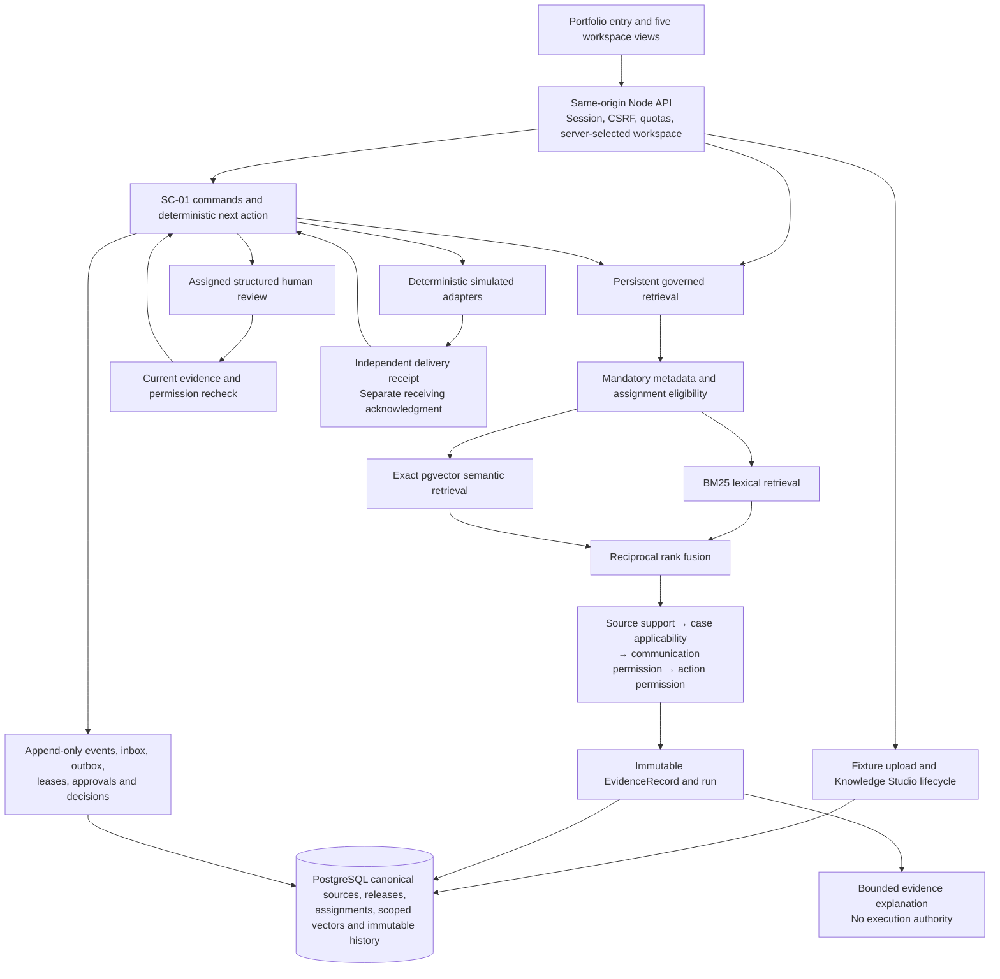

# Pathway Agent: evidence, persistence and bounded authority

**Portfolio status:** [Pathway Agent is live](https://case-resolution-agent.onrender.com) on Render with durable Supabase PostgreSQL/pgvector. The container build, database qualification and HTTPS checks passed; hosted browser acceptance passed. Everything in this project is synthetic.

## Problem → approach → demonstration

Patient-access documentation work involves more than finding an answer. A case can wait on an office document, a reviewer’s clarification, a verified transfer or acknowledgment from another system. These dependencies cross conversations and systems. The product hypothesis is that a persistent agent can own a bounded dependency while keeping its evidence, permissions and human handoffs explicit. No observed patient or business outcomes are claimed.

Pathway Agent combines a durable workflow with governed retrieval. It persists commitments and decisions in PostgreSQL, uses lexical and semantic retrieval to find candidate evidence, and makes four separate determinations before dependent work continues: source support, case applicability, communication permission and action permission. It gives ambiguity to a named reviewer with a structured question, then checks current authority again before resuming.

The SC-01 demonstration starts with a missing signed office note. The agent identifies the dependency through governed evidence, queues a separately permitted simulated follow-up, waits for a document, obtains human verification, transfers the exact approved package through a simulated adapter, and requires a matching receiving acknowledgment. It stops at **“Documentation dependency resolved; prior authorization pending.”** The interface makes that stopping condition visible throughout the journey.

A chatbot can provide useful explanations. This project explores the additional responsibilities required for ongoing work: durable state, timers, idempotency, unknown-delivery reconciliation, bounded human authority and evidence that survives source retirement. It does not claim that an LLM alone provides these capabilities.

## Six connected experiences

| Experience | What a reviewer can inspect |
| --- | --- |
| Guided portfolio entry | The problem, approach, synthetic scope and **Launch guided demo** entry point |
| Case workspace | Current dependency/state, next action, scenario checkpoint, agent/human timeline, delivery and acknowledgment |
| Pathway Agent | Evidence-grounded interaction, exact source quotations, assigned Knowledge Packs and explicit pauses |
| Knowledge Studio | Supplied synthetic TXT upload, validation/parsing metadata, sandbox collections, immutable releases, assignment, publication, retirement, supersession and retrieval testing |
| Evidence inspector | Included/excluded sources, passage identities, source versions, effective dates, retrieval ranks, all four determinations, reason codes and immutable records |
| Human review | Assigned role, blocking question, evidence, previous actions, allowed resolution, due time and durable resumption |

These screens read the application service and persisted database state. Source data, identities and external-system events are synthetic. Simulated events are clearly labeled; no external message or authorization request is submitted. The [walkthrough](demo-walkthrough.md) gives the visible controls and expected checkpoints.

## Architecture

This diagram describes the implemented application boundaries deployed as a Render Node service and a dedicated Supabase PostgreSQL/pgvector database. A single synthetic demonstration database is not equivalent to the stronger enterprise isolation proposed in the original architecture.

## Governed RAG

Retrieval finds candidates; similarity is not authority. Pathway constrains the operational search universe to allowed case, tenant, environment, assignment and source metadata before candidate scoring. It then checks authority/support and the four determinations independently. Broad inapplicable-candidate diagnostics in the benchmark never become the input to the operational pipeline.

A Knowledge Pack release pins an immutable source/version/passage manifest. Assignment selects which release applies to a case and workflow. Effective dates, supersession and retirement affect later retrieval. Historical evidence keeps the exact prior quotations and decisions. An uploaded sandbox replacement cannot become an operational authority by scoring highly or resembling a retired source.

Conflicting authoritative evidence pauses or escalates. Missing evidence abstains. Provider failure pauses without silently substituting lexical results. Lexical remains an explicit degraded option in the durable core, requiring recorded acknowledgment or a narrowly scoped prior system-policy grant. The public interaction does not expose an automatic fallback switch.

Public answers use deterministic exact claims and visibly report that no language model was called. The optional server-only OpenAI adapter can reorder a complete approved claim set and select a bounded explanation; it cannot invent statements, change citations, grant permissions or move the workflow. Public users cannot trigger new embedding or generation charges. See [controlled generation](controlled-generation.md).

## Persistent workforce

A recommendation is not a state transition. Permission is not execution. Dispatch is not acceptance. Receipt is not verification. Documentation completion is not payer approval.

PostgreSQL retains workflow snapshots/events, human decisions, knowledge lineage, timers and effect state. Commands and inbox messages carry idempotency identities; delivery is modeled as at-least-once with explicit reconciliation for unknown outcomes. The simulated receipt ledger can survive a local transaction failure after dispatch, permitting a restart to reconcile instead of blindly sending again. A matching receiver acknowledgment remains a separate completion gate.

A human resolution approves only the named task/package/recipient within its role and evidence boundaries. Resumption rechecks current sources and permissions. Retirement-first and resolution-first tests show deterministic commit ordering: an earlier valid decision stays historical, while later dispatch still observes retirement. There is no exactly-once external-delivery claim.

## Measured evidence

These are retained synthetic engineering measurements, not pharmaceutical validation or independent business trials.

| Measurement | Retained result |
| --- | --- |
| Frozen live retrieval set | 36 developer-authored queries over 19 synthetic source versions |
| Correct expected outcomes | BM25 31/36; semantic 36/36; unthresholded hybrid 36/36 |
| False abstentions | BM25 five; semantic zero; hybrid zero |
| Hybrid eligible recall / precision / MRR | 96.74% / 62.17% / 0.8478 |
| Hybrid with 0.35 cutoff | 34/36; rejected because two false abstentions return |
| Measured unsafe final outcomes | Zero in every arm; exact citation fidelity in every arm |
| Live embedding usage recorded | 3,435 input tokens; estimated incremental cost $0.0000687 |
| Preserved Phase 2D gates | 67 original tests, 24 PostgreSQL tests, 30 workflow tests; 23 governance cases and 108 retrieval parity comparisons |
| New controlled-generation contract tests | 12 passing tests with injected transports; no live-model quality inference |

Hybrid is the selected prototype configuration because it fixes lexical recall gaps and improves first-gold ordering more often than it worsens it relative to semantic. Both semantic and hybrid have equal final accuracy here; the ordering benefit is narrow. Reranking and query rewriting have no demonstrated consequential error pattern that justifies adding them yet.

Hybrid reused the cache populated by the semantic benchmark arm. Its recorded zero incremental embedding cost and lower latency do **not** establish an equivalent-condition cost or speed advantage. Five repeated runs establish cached-vector, ranking and governance reproducibility, not repeated fresh embedding-provider behavior. The benchmark has no independent holdout or production-scale evaluation. See the [full comparison](phase2b-comparison.md), [persistence verification](phase2c-verification.md) and [workflow verification](phase2d-verification.md). Application/browser/deployment checks must be reported separately as they complete.

## Safety and limits

Only supplied synthetic text fixtures are accepted. Size, type and exact content are validated server-side; unrecognized, executable, patient and proprietary content is rejected before storage. Sandbox content stays untrusted. Anonymous cryptographic sessions isolate disposable server-selected workspaces; demo-role switching is not enterprise authentication. Immutable records and forced RLS are defenses, not regulatory certification or protection against an administrator disabling controls.

The public service is capacity-bounded and uses no live paid model calls. Its local scenario calendar, seeded cases, coarse transaction locks, exact vector search, snapshot growth and simulated adapters are intentionally narrow. Availability, healthcare retention, enterprise identity, operational integrations, backup restoration, real-provider failure modes and production load need further work. Free-host sleeping can delay processing; scenario-clock timings are not staff-productivity measurements.

Pathway Agent does not determine payer approval, coverage, clinical judgment or financial-assistance eligibility. It claims neither HIPAA certification nor production readiness, and no real-world patient outcome. There are no customers, endorsements or business metrics implied by the demonstration.

## Resume-ready version

- Built a persistent synthetic patient-access workflow with PostgreSQL journals, structured human review, idempotent simulated handoffs and a bounded documentation-completion goal.
- Implemented governed hybrid retrieval with pgvector, immutable Knowledge Pack releases and four independent evidence/permission determinations; improved frozen synthetic expected-outcome accuracy from 31/36 with BM25 to 36/36 with semantic and hybrid retrieval.
- Designed and deployed an inspectable portfolio application spanning case operations, evidence-grounded interaction, Knowledge Studio and human resumption, verified through hosted restart/retirement/sandbox journeys and exact citation checks.

The public HTTPS journey is verified. These bullets describe a deployed synthetic portfolio application; they do not claim real-world healthcare outcomes.

## Interview talking points

- Why separate support, applicability, communication and action? A correct source can describe the wrong case, and applicable evidence still grants no right to communicate or execute.
- Why hybrid? The frozen benchmark supports a modest ordering benefit while preserving the lexical branch. It does not prove universal superiority or lower operating cost.
- What happens after a dispatch crash? Unknown delivery is reconciled against the independent receipt ledger before any retry; no exactly-once claim is needed.
- What does a human approve? A structured task or exact document/recipient binding, followed by a fresh governance check—not an unrestricted “continue” permission.
- What survives retirement? Earlier evidence and decisions remain immutable. New reliance sees retirement, including work queued before the change.
- Why no arbitrary public uploads or live model calls? The portfolio demonstrates real application boundaries while keeping the public environment synthetic and expense-bounded.
- What would change for production? Real identity, stronger isolation, data governance/retention, integration authorization, backup recovery, operational observability, load testing and domain validation would precede expansion.

## Visual evidence

Local responsive/browser screenshots and deployed screenshots are separate evidence. The [hosted verification](hosted-verification.md) links the inspected public-site screenshot set and immutable browser results. Local captures retain their original labels.

Public question privacy boundary: only the reviewed frozen synthetic questions, supplied literal/sandbox prompts and the explicitly labeled cache-failure probe are admitted. Other text is rejected before durable evidence/answer storage; no heuristic patient-data detector is used. The public API counts all attempted writes against a durable150-attempt session cap even when a later application transaction rolls back. Session refreshes share the normal read limiter.

## Local visual evidence

Five inspected [screenshots](screenshots/README.md) show the compiled local production experience. [MVP verification](mvp-verification.md) records151 passing automated tests and the real-browser checks. These images do not establish a deployed URL.
