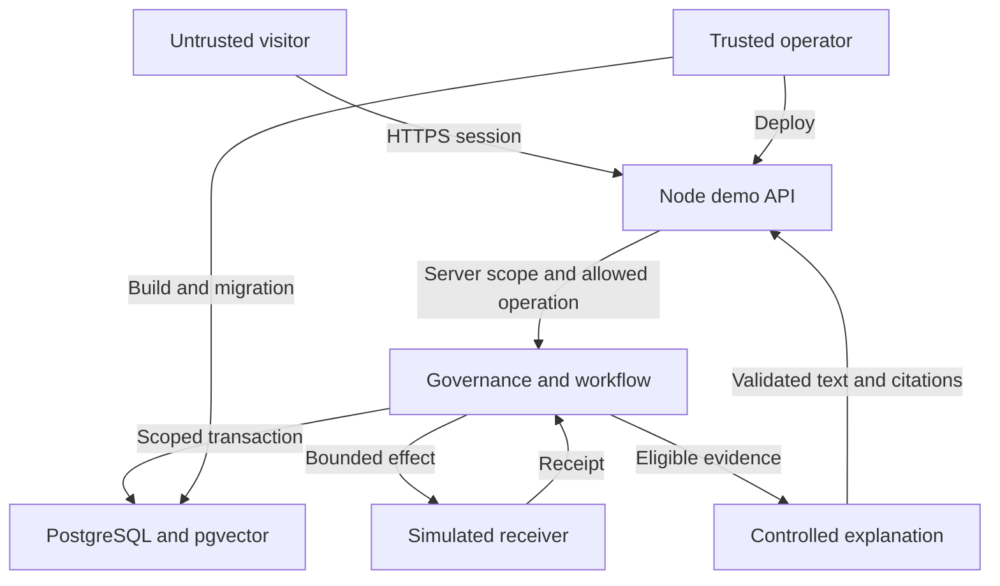

## Executive summary

The public synthetic Pathway Agent MVP adds an Internet boundary to a tested local governance engine. Its highest risks are cross-session authority, public resource exhaustion, and accidentally exposing privileged deployment credentials. The implemented HTTP boundary authenticates cryptographic session capabilities, checks CSRF/origin, bounds write attempts, and maps fixed demo operations to server-selected actors. Questions and uploads are restricted to reviewed synthetic content before evidence persistence. All fifteen security integration tests pass within the combined eighteen-test application suite (one journey, two recovery, fifteen security). Hosted account, TLS, proxy and live browser verification remain separate release gates; this is not a public-deployment security pass.

## Scope and assumptions

In scope: `src/db`, `src/workflow`, `src/pipeline.ts`, `src/policy.ts`, `src/app`, `src/generation`, `web`, provider adapters and migrations. The execution charter establishes public Internet exposure, exclusively synthetic cases, isolated guest sessions, deterministic simulated actions, no real outreach and no production-readiness claim. Uploads are restricted to canonical synthetic fixtures. Questions must match the frozen reviewed query catalog, canonical base/sandbox questions, or one explicit synthetic cache-failure probe. Unreviewed text is rejected before immutable records are written; this is an allowlist, not a heuristic patient-data detector. Public routes never construct a paid model provider. Those choices determine the risk ratings below.

The user explicitly authorized security reviews, routine fixes and autonomous continuation. Their charter supplies the service context and supersedes the skill's routine confirmation pause; no new assumption approval is inferred. Deployment account ownership and availability remain unresolved in `deployment-feasibility.md`.

The local CLI is trusted operator tooling, not a public endpoint. Existing fixture roles are a simulation; they must not become client-supplied identity assertions. Hosted account controls, secret managers, managed database versions and live headers have not been inspected. Real patient information, clinical decisions, external notifications and production pharmaceutical integration are out of scope.

## System model

### Primary components

- TypeScript/Zod application contracts and governed retrieval: `src/contracts.ts`, `src/pipeline.ts`, `src/db/retrieval.ts` (`PersistentRetrieval`).
- PostgreSQL scope and transaction boundary: `src/db/database.ts:21` checks nonprivileged runtime identity, sets transaction-local workspace/tenant/mode, locks, commits, then returns.
- Workflow command authorization, current knowledge checks and human decisions: `src/workflow/engine.ts:46`, `:60`, `:94`; append-only step repository in `src/workflow/repository.ts`.
- Simulated external delivery/reconciliation: `src/workflow/adapters.ts`, `src/workflow/worker.ts`; these are not real communication integrations.
- Provider-specific outbound call: `src/providers/openai-embedding.ts:26` fixes the HTTPS OpenAI endpoint and forbids redirects; this is unavailable to public guest operations in the proposed web boundary.
- HTTP session/API: `src/app/session.ts:14` hashes random 32-byte bearer values, uses a four-hour server-side expiration and HttpOnly/SameSite cookies, and locks the session row for mutations. `src/app/server.ts:22` sends CSP and response headers; its API handler validates origin, CSRF, methods and bounded JSON. `src/app/service.ts:30` derives scope from the stored session, not payloads.
- Controlled generation: `src/generation/index.ts` reconstructs only reviewed claims and exact citations. Public `Application.chat` calls `generate` without an external provider. `src/generation/openai.ts` is an operator-side adapter with fixed HTTPS destination, no redirects, timeout/response limits, strict output and no automatic retry; it is not reachable from guest provider selectors.
- Browser: `web/app.js:2` centralizes escaping for HTML text/quoted attributes; toast/error sinks use `textContent`. Templates use `innerHTML`, so future interpolations must preserve escaping and receive browser injection regression coverage. No exploitable unescaped visitor-input path was demonstrated by this source review.

### Data flows and trust boundaries

- Internet browser → Node API: cookie capability, CSRF/origin validation, 12,000-byte JSON limit and per-session read/write limits are implemented. All authenticated reads, including session refresh, use the same 240/minute cap. Valid-CSRF write attempts additionally use a durable 150-attempt lifetime budget committed before body parsing and outside the application's transaction, so failures/rollbacks cannot bypass the budget. HTTPS/Secure cookies must be verified on the host. Browser chooses an allowed demo operation, never a database scope, privileged actor, query provider, outbound destination or raw workflow command.
- Node API → domain services: validated operation → server-owned session scope and fixed synthetic persona. Authorization and present-state checks occur on every operation. A UI-hidden button is not a control.
- Domain services → PostgreSQL: parameterized SQL on a checked-out connection, transaction-local scope and forced RLS. The runtime role must not own the schema or bypass RLS (`src/db/database.ts:24`).
- Retrieved document → explanation provider/browser: document content is data, never an instruction or permission grant. Exact canonical citations and disposition must survive output validation; no generated text may call the workflow engine.
- Worker → simulated receiving system: durable idempotency key, independent receipt, explicit unknown/reconcile state. Delivery acknowledgment is separate from permission and from case completion.
- Operator → build/deployment/migrations: trusted source and server secrets; migration credential is separated from the web process. No public route may invoke shell tools, migrations, arbitrary SQL or environment inspection.

#### Diagram

## Assets and security objectives

| Asset | Why it matters | Security objective (C/I/A) |
| --- | --- | --- |
| Server database/API credentials | A leak exceeds the synthetic demo boundary | C, I |
| Per-session evidence and case state | Other visitors must not mutate/read another session | C, I |
| Four determinations and current authority | A relevant source or answer must not authorize an action | I |
| Historical records and citations | Retirement must not rewrite prior decisions | I |
| Hosting capacity and quota | Public traffic must not create unbounded spend or durable growth | A |
| Build provenance and portfolio claims | The deployed experience must correspond to reviewed code and measurements | I |

## Attacker model

### Capabilities

A remote visitor can create cookies, replay requests, vary headers and payloads, submit forbidden files, guess object IDs, open many sessions, race commands and embed instructions in submitted text. They can read delivered JavaScript and all public assets. A separate website can try CSRF, framing and browser-origin confusion.

### Non-capabilities

The visitor has no administrator database password, no operator shell, no trusted role assignment, no real patient corpus and no legitimate real-world communication adapter. If they obtain a server secret or arbitrary code execution, these non-capabilities cease to hold and severity rises. A stolen session bearer grants that one disposable session until expiry, not an organizational identity.

## Entry points and attack surfaces

| Surface | How reached | Trust boundary | Notes | Evidence |
| --- | --- | --- | --- | --- |
| Session creation/reset | Public HTTP | Internet/API | Durable quotas, five-demo cap, capability expiry | `src/app/session.ts:14`, `src/app/service.ts:34` |
| Case/human/Studio commands | Public HTTP | API/domain | Server maps operation to authorized synthetic persona | `src/app/service.ts:56`, `src/workflow/engine.ts:94` |
| Question/upload body | Public HTTP | Parser/evidence | Strict schema, fixture byte equality, cap; no URL fetch | `src/app/service.ts` (`chat`, `upload`), `src/app/server.ts:11` |
| Evidence lookup | Public HTTP | Session/database | Scope derives from stored session; no generic evidence-ID route | `src/app/service.ts:30`, `src/db/database.ts:27` |
| Rendering explanation/source text | Browser | Data/DOM | Escaped text; CSP; template sinks need regression review | `web/app.js:2`, `:49`; `src/app/server.ts:22` |
| Effects/timers/receipts | Worker commands | Workflow/simulation | Permission recheck and bounded retry | `src/workflow/worker.ts`, `src/workflow/engine.ts:60` |
| Provider outbound API | Trusted adapter | Server/provider | Fixed destination, timeout, no redirect | `src/providers/openai-embedding.ts:26` |
| Migration/runtime credentials | Operator deployment | Control plane/runtime | Separate roles; never ship local database | `src/db/database.ts:12`, `:36`; `.gitignore` |

## Top abuse paths

1. Cross-session edit: obtain own session → submit another workspace/actor/evidence ID → impersonate publisher/reviewer → retire or approve another visitor's case. Bind all IDs to server session and fixed personas before repositories run.
2. Cost/storage exhaustion: repeat anonymous session creation → seed many vector/evidence copies → exhaust free database or force paid calls. Cap globally and per session/IP; disable guest provider calls; make expiration operational.
3. Untrusted content execution: submit script-bearing document or malicious source text → render as HTML or feed model as instruction → steal session or invent permission. Reject nonfixture bytes and render as text; generated output has no execution authority.
4. CSRF/reset abuse: malicious origin uses ambient cookie → requests retirement/reset/approval → disrupts user's demo. Require exact configured origin plus CSRF token for mutations and SameSite cookies.
5. Retirement race: queue authorized effect → retire source → dispatch using stale evidence. Worker must reread current authority inside the shared lock; earlier history remains historical only.
6. Credential exposure: package `.env`/`.local` or return raw exception → leak database/provider secret → bypass application isolation. Allowlist production assets and use fixed public error codes.
7. Fake receiving acknowledgment: expose raw `ack` command → visitor claims successful receiving update → prematurely complete. Only bounded simulator endpoints generate fixed receipts; completion still requires verified document and receiving acknowledgment.
8. Frozen deployment: free host sleeps or database pauses → process memory loses timer ownership → UI implies continuous action. Persist deadlines/leases and reconcile on wake; communicate sleep/catchup honestly.

## Threat model table

| Threat ID | Threat source | Prerequisites | Threat action | Impact | Impacted assets | Existing controls (evidence) | Gaps | Recommended mitigations | Detection ideas | Likelihood | Impact severity | Priority |
| --- | --- | --- | --- | --- | --- | --- | --- | --- | --- | --- | --- | --- |
| TM-001 | Remote guest | HTTP routes accept identifiers | Change session scope or actor | Cross-session authority | Evidence, workflow | Scoped RLS and fixed role checks in `database.ts:24`, `engine.ts:94` | HTTP binding verified locally; hosted topology pending | Keep random HttpOnly bearer and server-only scope/personas; retain cross-session negative tests | Rejected scope/ID counter without tokens | High: simple payload manipulation | High: trust boundary broken | high |
| TM-002 | Automated guest | Anonymous creation/work requests | Flood seed/query/storage | Availability or spend | DB/API quota | Exact cache-only provider path in `db/vector.ts` | 64 lifetime-workspace cap intentionally retains immutable history; hosted quota unknown | Keep global/session/IP caps and no guest paid calls; documented operator capacity management; do not imply expiry frees immutable workspaces | Active session/storage/429 counts | High: cheap automation | Medium: demo outage, financial if uncapped | high |
| TM-003 | Uploaded/source text | Rendering or model interpolation | Script or prompt injection | Session theft or false authority | Cookies, decisions | Pipeline validates passages and separates decisions | Template HTML sinks require continuing escaping discipline; browser injection regression pending | Fixture hash allowlist; text rendering; CSP; structured output/citation validation; no model tools | Rejected content/output disposition | Medium: exposed input, narrow fixture plan | High for credential theft | high |
| TM-004 | Cross-origin website | Ambient session cookie | Forge mutation/reset | Unwanted session changes | Session history | Domain state checks | Local HTTP CSRF/origin rejection verified; hosted PUBLIC_ORIGIN pending | Exact configured Origin; CSRF token; SameSite; no permissive CORS | Origin/CSRF rejects | Medium: requires active session | Medium: synthetic session disruption | medium |
| TM-005 | Racing guest | Queued effect/current retirement | Force stale dispatch/replay | Incorrect action authority | Governance integrity | Shared lock and current knowledge checks `engine.ts:60` | Assignment/current retrieval reuses the transaction lock; hosted race verification pending | Test concurrent retire/dispatch; no raw effect endpoint | Pause and authorization events | Low: covered core serialization | High: core thesis fails | medium |
| TM-006 | Public client/build leak | Overbroad static root/error | Retrieve secrets or admin connection | Account compromise | Credentials | `.gitignore`; driver error suppression `database.ts:19` | Private-path/error tests pass; final production bundle and hosted secret checks pending | Public asset allowlist; no logs of request/token/driver details; admin absent runtime | Sanitized error codes; bundle scan | Medium: common integration mistake | High: non-demo impact | high |
| TM-007 | Guest acting as receiver | Raw workflow commands exposed | Forge ack or human persona | False completion | Outcome integrity | Role checks `engine.ts:98` and structured approvals | Fixed simulated actor mapping tested; not enterprise identity | Named simulator operations only; bind document/receipt/task and session | Immutable resolution and receipt events | Medium: easy if endpoint exists | Medium: synthetic claim corrupted | medium |
| TM-008 | Platform lifecycle | Sleep/restart/expired session | Lose work or access stale bearer | Misleading persistence/availability | Timers/session state | Durable workflow steps and reconciliation | Expiry/durable limit tests pass; hosting sleep/proxy behavior unverified | Persist sessions; expire server-side; bounded wake reconciliation; no continuous SLA claim | Last worker tick, due backlog | High: expected free-host behavior | Medium: demo unavailable/misleading | medium |

## Criticality calibration

- Critical: public remote code execution exposing hosting secrets; credential leak enabling broad account control. No such verified issue is claimed here.
- High: cross-session role/scope bypass; guest-triggered uncapped paid calls; exploitable stored source XSS.
- Medium: bounded demo denial of service; forged synthetic completion; CSRF mutation of one disposable session.
- Low: disclosure of already-public synthetic fixture text; incorrect nonsecurity status label without authority effect.

Highest-ranking assumptions: anonymous Internet access, shared resource limits, server credentials carrying real account authority, and the planned restriction to fixture-only synthetic bytes. Replacing fixtures with arbitrary uploads requires a new ingestion/privacy review; enabling guest paid calls requires a new financial abuse review.

## Focus paths for security review

| Path | Why it matters | Related Threat IDs |
| --- | --- | --- |
| `src/app/server.ts`, `src/app/session.ts`, `src/app/service.ts` | Session capability, origin, size/rate, operation mapping, static path boundary | TM-001–004, TM-006–007 |
| `web/app.js` | Untrusted text sinks and public secret absence | TM-003, TM-006 |
| `src/generation/index.ts`, `src/generation/openai.ts` | Evidence gating, citation binding, no tools/actions, resource budgets | TM-002–003 |
| `src/db/database.ts` | Per-transaction scope and runtime role enforcement | TM-001, TM-005–006 |
| `src/db/retrieval.ts` | Explicit provider failure, durable evidence, historical replay semantics | TM-003, TM-005 |
| `src/workflow/engine.ts` | Human authorization, source recheck, completion boundary | TM-005, TM-007 |
| `src/workflow/worker.ts` | Reconciliation, timer/effect retry, cancellation | TM-005, TM-008 |
| `migrations/` | Forced RLS, immutable records, new session retention authority | TM-001, TM-002, TM-006 |
| Production build/deployment config | Asset allowlist, role separation, TLS and free-tier limits | TM-002, TM-006, TM-008 |

## Review results and release gate

`npm run typecheck` and the fresh combined application run passed: eighteen tests, comprising one journey, two recovery and fifteen security tests. This includes the new privacy/read-cap/lifetime-attempt regressions and both crash-recovery fixes. Tests use a real ephemeral loopback Node server, the restricted local PostgreSQL role and cryptographic synthetic test sessions. They do not consume public session-creation quotas or execute model calls. Each run seeds only three bounded retained workspaces; threshold tests modify and restore only their own unique fixture counters.

| Finding / control | Evidence and disposition |
| --- | --- |
| Repeated launch created a fresh workspace before the response was safely delivered | Found in `Application.start` routing during review; fixed by root in `/api/demo` to preserve an existing session workspace. Regression confirms repeated and alternate-scenario launch bodies preserve workspace, scenario and reset count. |
| Checkpoint clock and target could diverge after a cross-transaction crash | Review found core future-dated steps could commit before the session clock/HTTP receipt. `Application.intent` now persists the original timer/effect binding and request fingerprint; action/view clocks reconcile against durable workflow time; retries recover the original target. `tests/app/recovery.test.ts` covers loss of the outer receipt followed by later worker progress, avoiding a different timer firing on replay. |
| Answer could regenerate after core commit and outer receipt loss | `Application.chat` now stores a validated `ChatReceipt` atomically with its evidence/answer in the governed transaction. Recovery loads the exact response, including answer ID and latency, before rebuilding the portfolio view. The recovery regression also rejects changed-mode reuse of the request key. |
| Session refresh bypassed read quotas | `/api/session` now applies the same `read.<session-hash>` counter as `/api/state` before returning the full workspace. The regression places only its test session at 240, verifies 429 from both routes, then restores that test key. |
| Failed mutations could accumulate unlimited immutable rejection/intent records | `src/app/server.ts` now increments `attempts.<session-hash>` before body parsing with a 150-attempt/4-hour budget. This counter commits independently of the business transaction, preventing rejected commands or infrastructure rollbacks from evading lifetime limits. Its row stores key/count/expiry only, never request content. The regression checks one real business rollback plus a seeded threshold instead of issuing 150 requests. |
| Arbitrary questions could persist unreviewed personal text | `Application.chat` rejects noncatalog questions with 422 before intent/retrieval/answer writes. The privacy regression verifies unchanged scoped evidence/answer/audit and portfolio-item counts, and confirms the response does not echo the canary question. |
| Strict identity and scope mapping | Forged actor/workspace/provider/raw workflow fields return 400 or 404. Wrong synthetic role returns 403. Separate sessions retain distinct workflows and answers. A release published in session B cannot be assigned in session A; durable historical evidence lookup under B cannot retrieve A's record. |
| Release assignment authority | `Application.action` requires knowledge-reviewer persona and an exact workspace-published release; under one governance transaction it writes an explicit immutable user release grant, then `assignInTransaction` versions the case assignment. This is a deliberate synthetic publisher operation, not a retrieval inference or automatic grant from publication. Previous records and bound approvals are not rewritten. |
| CSRF and origin | Missing/wrong tokens, foreign Origin and cross-site Fetch Metadata return 403 without workflow change. GET session responses do not expose bearer/hash/full session row. CSP, no-store, nosniff and no-referrer were inspected on actual responses. |
| Upload admission | Unknown synthetic text, executable HTML, altered fixture bytes and unsupported attestations are rejected; oversized/mistyped requests fail; upload-row count remains unchanged. Only exact supplied fixture bytes enter sandbox ingestion. |
| Answer integrity and cost | Replayed answer body is exact; changed query with the same key fails; runtime UPDATE cannot alter the immutable answer. Citation objects match the EvidenceRecord. Public answer reports zero provider attempts/cost and no execution authority. |
| Replay/reset limits | Action-payload changes under a reused key fail. Duplicate reset does not reseed, old-demo action replay fails, and exhausted five-demo limit leaves current workspace unchanged. |
| Error and static boundary | Private environment/source/local-database paths and admin/migration API paths return 404. A synthetic driver-shaped exception containing a test secret returns a generic 503 without its credential, payload or stack. |
| Expiration/rate persistence | Expired capability fails; durable rate limit survives reconstruction of the Sessions wrapper. |
| Lifetime capacity | `Sessions.reserveWorkspace` intentionally retains at most 64 reserved workspaces. Session/upload metadata expiry does not free immutable governed history. This prevents unbounded durable growth but can permanently stop new demos until an operator provisions a reviewed fresh demo database/capacity. It is an availability tradeoff, not automatic garbage collection. |

No verified critical/high exploit remains in these tested local API paths. This limited statement does not cover live hosting, full browser behavior, every possible denial-of-service pattern or a production identity system. Model adapter budgets are process-local and intended for bounded trusted use only; exposing it to guests would require separately durable financial quotas.

Remaining release verification: final production bundle/static-secret audit, deployed origin/TLS/Secure-cookie behavior, trusted reverse-proxy/IP configuration, live session isolation and browser journey/injection checks. `remoteAddress` limits currently count the socket peer; a shared hosting proxy may group visitors. Do not blindly trust arbitrary forwarded IP headers to make the limit appear correct. Confirm this against the selected host or retain a documented conservative global limit.

Runtime and trusted development surfaces are distinguished, and each discovered trust boundary is represented. Hosted identity, live TLS/header configuration and installed hosted roles are not asserted verified. This report is not a HIPAA, production-readiness, penetration-test or vulnerability-free certification.
