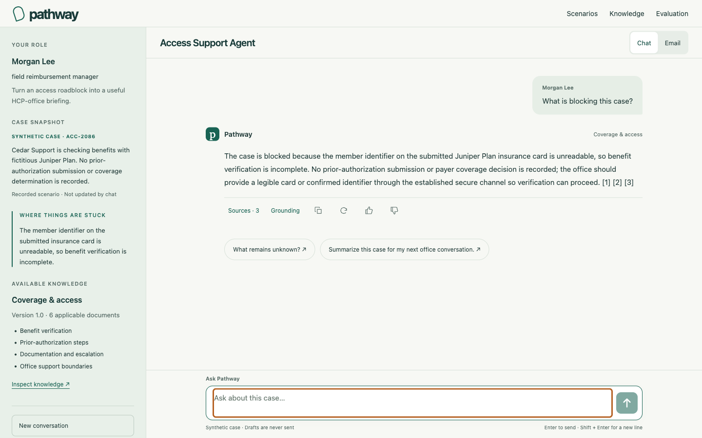

# Compact conversation workspace

The conversation workspace now uses a persistent 300px context sidebar on desktop and a flexible chat/email panel. The global navigation is 56px tall and the desktop conversation header is 64px. The sidebar and transcript scroll independently; the composer stays inside the conversation panel. All three scenarios share the layout.

The left panel explains the user's role and objective, recorded case snapshot, current blocker, and selected knowledge pack with its version, eligible document count and covered topics. Below 1,024px, a Case context button opens a native modal drawer with an explicit keyboard focus loop, Escape/close controls and focus restoration. Switching knowledge updates the sidebar while historical answers retain their original source snapshots.

Sources and Grounding share one action row with copy, regeneration and feedback icons. Drafts use that same row for copy and refinement. Narrow panels expose additional actions through a native popover positioned within the viewport, avoiding clipping by the transcript. Evidence panels preserve their expansion through ordinary rerenders. Regeneration creates another turn; failed-request retry reuses the original request, and the latest eligible draft remains refinable.

The catalog adds presentation-only `caseSummary` and `blocker` fields. These are curated synthetic snapshot text and do not enter generation prompts or retrieval. No migration, new endpoint, model change or request-limit change is included.

## Verification

Type checking, 89 core tests, 22 RAG tests, the production build and repository hygiene checks passed. Local Chromium replay of retained synthetic responses passed **126 checks**, including all three scenarios in both formats at 375, 768, 1,024 and 1,440px, plus a 375×520 reduced-height check. This is UI verification, not new model-quality evidence; replay made no provider calls.

Checks covered exact source text, grounding disclosure, copy, regeneration, helpful feedback and reload, draft refinement, mobile overflow actions, keyboard drawer focus, rerendering during a pending answer, knowledge switching with historical sources, simulated HTTP 503 recovery without duplicate questions, preserved unsent text, reduced motion and independent scrolling.

A scoped frontend security review confirmed text-node rendering, constant SVG paths, existing same-origin/CSRF requests, and no new credential storage or executable content from model/source text. Existing CSP and hosting protections remain in place. Physical mobile keyboards and other browser engines have not been separately qualified.

Retained checks: [workspace-8fd4ac20615437a1c0d1044326db489121b891ed88fcc1533d6247f061ba1ce5.json](../../artifacts/rebuild/workspace-8fd4ac20615437a1c0d1044326db489121b891ed88fcc1533d6247f061ba1ce5.json).

## Local replay screenshots

[Mobile conversation](screenshots/compact-mobile.png) · [Case context drawer](screenshots/compact-drawer.png)
