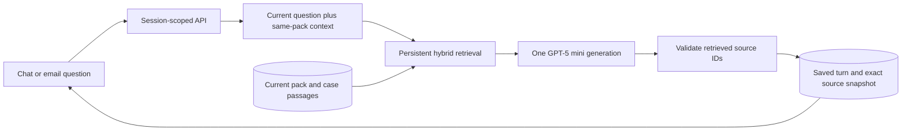
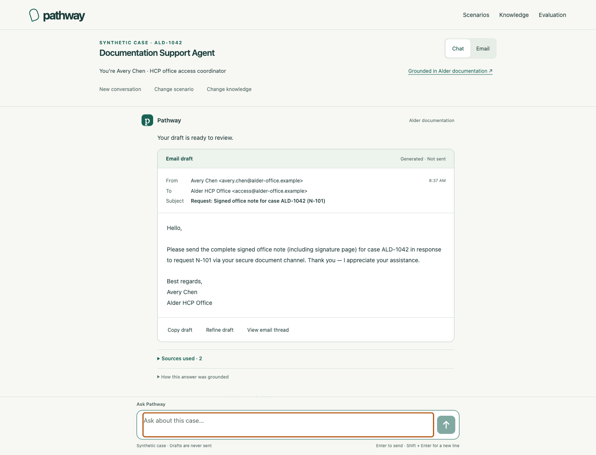
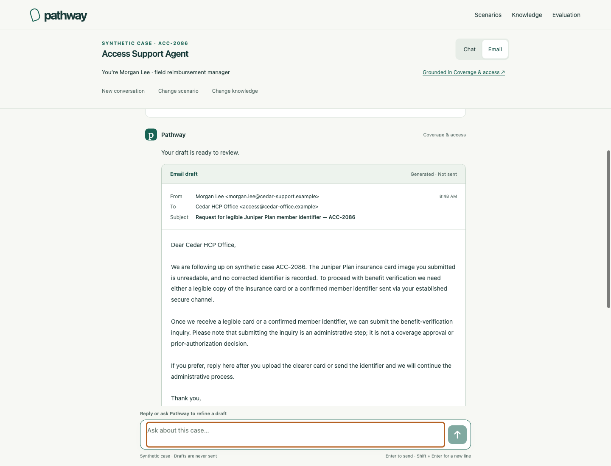
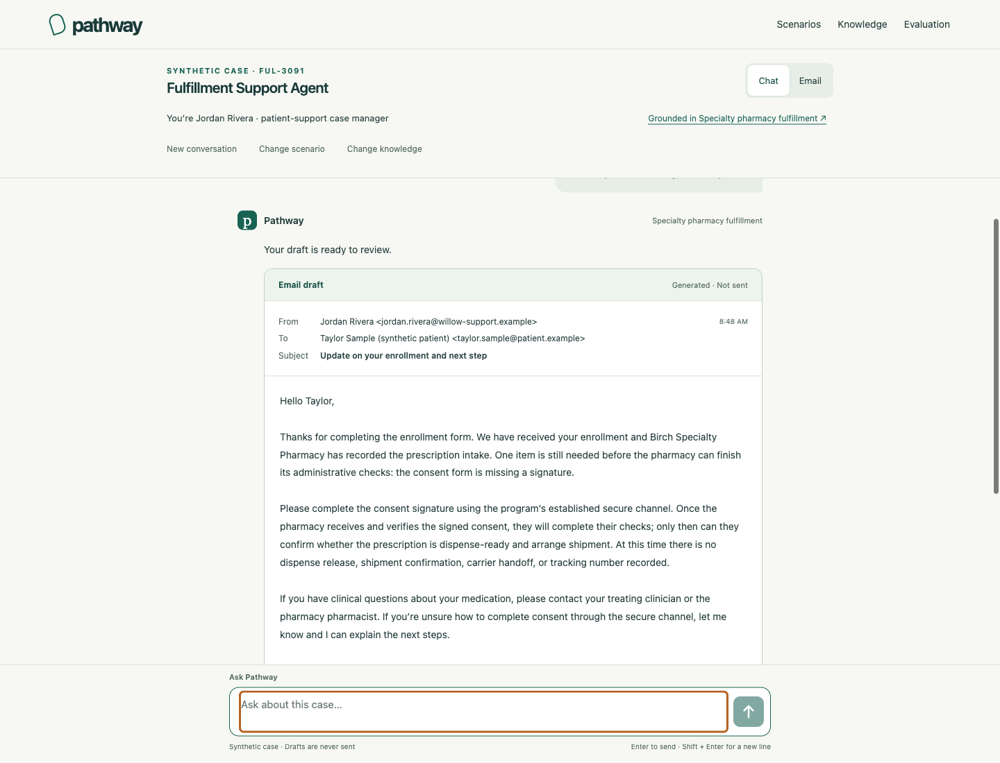

# Pathway RAG rebuild — delivered September 12, 2026

[Open the public demonstration](https://case-resolution-frontend.onrender.com)

Pathway is now a conversation-first synthetic pharmaceutical-support demonstration. A visitor chooses one of three roles, asks an administrative question, follows up naturally, prepares a draft and inspects the exact knowledge behind the answer. The landing page, chat, email thread, Knowledge Pack browser and evaluation view replace the old workflow-oriented entry point.

## Delivered experience

Three scenario cards launch directly into an oriented conversation. The active case, user and agent role remain visible. Ready-to-submit questions require no attestation, setup form or Continue step. Chat supports Enter/Shift+Enter, progress, retry, regeneration, copy, feedback and new conversations. Email has From, To, Subject, time, body, reply/refinement and generated/not-sent status. No email is sent.

Sources used expands to numbered exact passages, titles, sections, versions and the original Knowledge Pack. The optional grounding panel explains the contextual query, retrieval rank, included passages and final source mapping. Switching knowledge changes the case and available evidence while preserving historical answers. A source list supports the whole answer; membership is validated without requiring an elaborate inline claim ledger.

| Scenario | User and agent | Knowledge and work product |
| --- | --- | --- |
| HCP office documentation | Avery Chen, office access coordinator; Documentation Support Agent | Alder PA pack, ALD-1042 / N-101. Signed office note including signature page; receipt and deadline distinctions. Office request email. |
| Field reimbursement | Morgan Lee, field reimbursement manager; Access Support Agent | Coverage and Access pack, ACC-2086. Unreadable Juniper member identifier blocks verification; benefits and payer outcomes remain unknown. Office briefing or email. |
| Patient-support fulfillment | Jordan Rivera, case manager; Fulfillment Support Agent | Specialty Pharmacy Fulfillment pack, FUL-3091. Enrollment/intake recorded, consent signature missing, shipment unconfirmed. Patient-friendly status message. |

All people, cases, plans, organizations and sources are fictional. Each pack has eight short documents: six current/applicable, one superseded and one unrelated case. The corpus has 24 documents and 38 section-sized passages. Excluded documents remain readable in the knowledge browser but cannot support a new answer. Optional temporary upload is deferred; the seeded knowledge experience is complete.

## Preservation and architecture

The previous source, research and evaluation evidence are preserved on branch `preserve/pre-rag-rebuild-2026-09-11` at `941ccdb0f7d58d718d4298db9cd4b5c9fb2f8944`. The local pre-rebuild archive is `.local/preservation/pathway-before-rag-2026-09-11.tar.gz`, SHA-256 `729bd9785ace9ff40e8ed1bc42f2ee20b134fa0803df98ef251adf805ed52037`. Frozen Phase 2A/2B artifacts were not overwritten.

The new `src/rag/` implementation and independent database schema replace the old intent engine, claim ledger, workflow-state interface, permission forms and multiple generation/review calls in the primary product. The old modules remain preserved. Reused components include Node/TypeScript, secure sessions, CSRF, PostgreSQL/pgvector, TLS, durable provider counters and the existing Render/Supabase resources.

Retrieval combines vector and lexical rank after pack, case and current-version filtering. Conversation history resolves references; it does not establish facts. Missing query embeddings are cached persistently. Generation uses the Responses API with a strict small response object and at most one bounded format repair using the same evidence. Keys stay on the server. The static catalog is built from canonical source definitions, avoiding a second hand-maintained corpus.

## Actual evaluation results

These are distinct retained runs, not independent samples pooled into one score. Assistant semantic review is not independent clinical or expert validation.

| Measure | Retained result |
| --- | --- |
| Frozen direct retrieval | 36 cases; 97.69% mean expected-passage recall; 36/36 pack/case isolation and exact text |
| Complete live conversation suite | Three 12-turn conversations; all 36 completed |
| Contextual expected-passage recall | 98.61% |
| Citation membership / canonical text | 115/115 cited IDs retrieved; exact stored text on 36/36 turns |
| Original full semantic review | 34/36 complete criterion matches; two partial results retained |
| Original answer-level unsupported status formulation | 1/36: missing consent signature shortened to missing form; targeted correction subsequently passed |
| Unsupported amount or tracking questions | 3/3 knowledge gaps identified, no invented amount or tracking number |
| Clinical questions | 3/3 refuse advice; an omitted explicit referral was corrected in targeted checks |
| Contextual reference resolution | 12/12 reviewed why/after/evidence/refinement cases |
| Work products | 7/7 requested drafts or summary returned; refinements 53%, 51% and 48% shorter |
| Knowledge-switch supplement | 6/6 complete; 100% expected recall, isolation, exact text and historical preservation |
| Full-run HTTP latency | Median 6.861 s; maximum 14.258 s |
| Full-run token usage | 109,241 input, including 21,888 cached; 18,630 output |
| Full-run cost | $0.05972259 estimated, including query embeddings; 43 generation requests with 7 repairs, 33 embedding requests |

The complete run preceded the final source-list presentation correction. Four frozen wording checks passed after the first review. The later six-step source-list supplement needed no repair. Final public draft checks target the two details found during browser review; the entire 36-turn suite was not rerun after those narrow constraints. See the [live review and before/after traces](conversation-review-2026-09-12.md) for the exact scope and original scores.

## Browser and public acceptance

Real Chromium tested 375, 768, 1024 and 1440 pixel widths. Landing, knowledge, evaluation and conversation layouts had no horizontal overflow. Visible buttons, links and summaries met 44×44 pixels. The composer stayed in the viewport, including a reduced 375×520 viewport. Keyboard source expansion, visible focus, Enter/Shift+Enter, reduced motion, exact clipboard copy, feedback, disclosure preservation, reload persistence, channel changes and knowledge changes were checked.

Local interaction tests used explicitly labeled replays of retained synthetic responses. Separate public tests used actual GPT-5 mini answers: ten turns across the three scenarios, including a six-turn mobile Alder conversation, draft refinement, a knowledge switch and a clinical question. All ten returned exact eligible source passages. The Alder draft changed from 79 to 38 words, retaining the signed-note request and secure-channel instruction. A client-injected HTTP 503 tested recovery; the retry completed against the live service with the same request identifier and no duplicate turn. The injected failure itself incurred no provider request.

Review found two partial public drafts: access added identity-field examples absent from its sources, and fulfillment assumed an earlier enrollment channel. Both original outputs remain retained. Focused draft constraints corrected those details in two additional live runs in a fresh browser on the final revision. Both corrections passed source membership, canonical text and pack/case isolation. The corrected drafts still require review for prospective wording and tone.

The ten-turn public run cost $0.01335279, with median measured service latency 7.456 s and maximum 9.232 s. The two final draft checks cost $0.00339625 and took 7.559 / 8.380 s. Service timings exclude some HTTP/UI overhead. Total known estimated cost across retained rebuild runs is approximately **$0.4410**, including unsuccessful comparisons; this is not an account billing statement.

Verification passed: type checking, JavaScript syntax checks, 89 core tests, 21 RAG tests including real PostgreSQL integration, production build and secret-hygiene scan. Both services served byte-identical built HTML, JS, CSS and catalog files with CSP and `nosniff` headers. The free resources and credential boundaries were retained.

## Model, allowance and deployment

- **Conversation:** `gpt-5-mini`, low reasoning. No flagship fallback. The active model was confirmed from public session metadata before generation.
- **Embeddings:** `text-embedding-3-small`, 1,536 dimensions.
- GPT-5 mini standard rates verified September 12: $0.25/M input, $0.025/M cached input, $2/M output ([official model documentation](https://developers.openai.com/api/docs/models/gpt-5-mini)). Embeddings are $0.02/M tokens ([official embedding documentation](https://developers.openai.com/api/docs/models/text-embedding-3-small)).
- **Rebuild acceptance source revision:** `c3468743b6e291d4f47bc27336d791eff65eda3b` on both existing Render services at the original verification.
- Backend deployment: `dep-daimbaek1f9s738ptdhg`; frontend deployment: `dep-daimbd3m8hqs73df2gcg`.
- [Public frontend](https://case-resolution-frontend.onrender.com) · [Backend](https://case-resolution-agent.onrender.com) · [Release source](https://github.com/ktakeuchi21/case-resolution-agent/commit/c3468743b6e291d4f47bc27336d791eff65eda3b)
- At original rebuild verification, **398/400 provider reservations** were used for September 12 UTC. This dated allowance was subsequently superseded by the user's request for a [persistent 1,000-request daily ceiling](persistent-allowance-2026-09-12.md). Reservations include embeddings and repairs, so they do not correspond one-to-one with answers. No counters are reset; the 40-request session ceiling remains.

## Screenshots

Alder: retained live warmer/shorter draft, displayed on the final release.

Access: corrected live office email in the default email presentation.

Fulfillment: corrected live patient-support status draft.

[Landing](screenshots/landing.png) · [Six-turn mobile source inspection](screenshots/mobile-sources.png)

## Limits and next phase

This is a synthetic portfolio demo, not a production healthcare system. Valid source IDs do not prove that every generated phrase is fully supported. Drafts can still contain future-facing language such as “we will continue” or “they will complete their checks”; a reviewer should edit commitments before using copy. No actual outreach, clinical decision, payer decision or delivery guarantee occurred.

The small curated corpus and repeated development questions limit generalization. Browser verification covers Chromium at mobile/tablet/desktop viewports; physical iOS/Android keyboard behavior and other browser engines have not been separately qualified. Anonymous sessions expire after four hours. Free-service cold starts, two concurrent API requests and the daily/session request ceilings constrain availability. Uploads and real integrations remain deferred.

The next useful phase is independent review on an unseen synthetic question set, with claim-level support scoring and draft commitment checks. Expand the corpus only after that review, then evaluate temporary session-isolated uploads as a separate feature. Real clinical data or external workflow effects would require a separate authorization and deployment design.

Retained public artifacts: `browser-b66d9308dbb1d1b617b21c3693d7b1e78a39660951c7e0c52ad0ffafb739886c.json` and `browser-draft-c927cd94fe2850f3e909b02e38ac2adbbf7b365501b0234b17bc3497ac2c7579.json` under `artifacts/rebuild/`.
